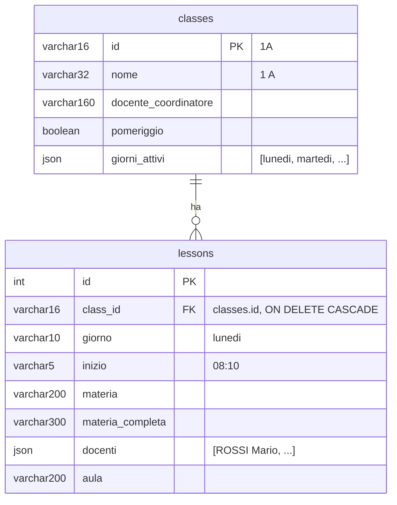

# Schema del database (orari)

Il database serve solo per gli orari delle classi (`SCHEDULE_SOURCE=db`). Voti e agenda arrivano sempre da ClasseViva.
Due tabelle, create da `python -m scripts.import_schedules`.



- `UNIQUE (class_id, giorno, inizio)`: una classe non può avere due lezioni nello stesso slot.
- Ora di fine e numero d'ora non sono salvati: si calcolano dalla griglia (inizio 08:10, ore da 50 minuti) in `app/schedules.py`.
- Cancellare una classe cancella le sue lezioni.
- Reimportare una classe sostituisce tutte le sue lezioni; una classe presente solo nell'indice aggiorna i dati della classe e tiene le lezioni esistenti.

## Query utili

```sql
-- orario di una classe
SELECT giorno, inizio, materia, aula FROM lessons WHERE class_id = '1A' ORDER BY giorno, inizio;
-- dove sono le ore di un docente (docenti è JSON; su PostgreSQL con cast a jsonb)
SELECT class_id, giorno, inizio FROM lessons WHERE docenti::jsonb ? 'ROSSI Mario';
```

Se in futuro servono ricerche per docente o aula frequenti, si possono estrarre in tabelle proprie: `Lesson` è l'unico punto da cambiare, insieme a `DbStore` e all'import.
